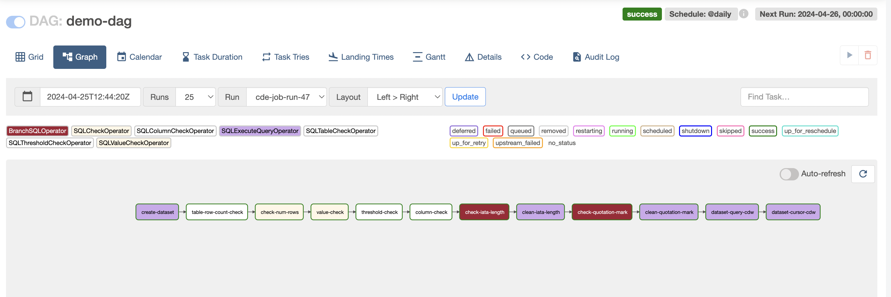
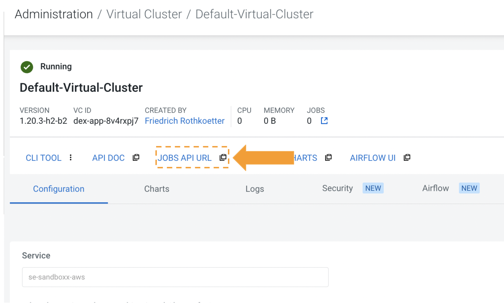

# SQL Operator in Apache Airflow with Cloudera Data Warehousing


In Cloudera Data Engineering (CDE), the integration of Apache Airflow brings powerful workflow orchestration capabilities to the platform, allowing users to seamlessly manage and schedule data pipelines.

## Introduction

Recently, Cloudera has introduced new support for Airflow's SQL operators, enhancing the capabilities of SQL tasks within Cloudera Data Platform (CDP). This integration allows users to seamlessly with Cloudera Data Warehousing (CDW) service execute SQL commands and perform database operations using Airflow within the Cloudera ecosystem. CDE users can now leverage familiar SQL-based tasks directly within their Airflow workflows, enabling efficient database interactions and data processing.

This integration enhances the flexibility and efficiency of data workflows within Cloudera's ecosystem, empowering users to build robust and scalable data pipelines.



## Lab 0 - Clone the github

In your home directory

```bash
git clone
```

-----
## Lab 1 - Create Database

Navigate to Data Warehouse, then Virtual Warehouse and open the HUE SQL Authoring tool.

Create new database for your user to be used, or use one that is already created for you.

```sql
-- Change *** of database name
CREATE DATABASE DB_USER0**;

USE DB_USER0**;
```
Your can check your current database
```sql
select current_database();
```
-----
## Lab 2 - CDE CLI configuration

Copy the Jobs API URL from the CDE Virtual Cluster page



i.e.

```sql
https://8v4rxpj7.cde-dvtxl9n8.se-sandb.a465-9q4k.cloudera.site/dex/api/v1
```

Edit the CDE cli config.yml file and add the Job API URL to the vcluster-endpoint
and the your login ID (user001..030)

```sql
% vi ~/.cde/config.yml

user: user001
vcluster-endpoint: https://8v4rxpj7.cde-dvtxl9n8.se-sandb.a465-9q4k.cloudera.site/dex/api/v1      
```

Save the file and return to the github


Results


|

Results

|DESCRIPTION\_CRYPT|DESCRIPTIION|
| :- | :- |
|RhTzKHhSBr7RD3pGudQG3g==|	AEROSPATIALE|
|S0w4E8xFm3q1FaeKG99NAaNG7uqU2XAsD2A94p79NYk=|	AEROSPATIALE/ALENIA|
|HIL21crGdEnSYvLIqiKzNQ==|	AIRBUS|
